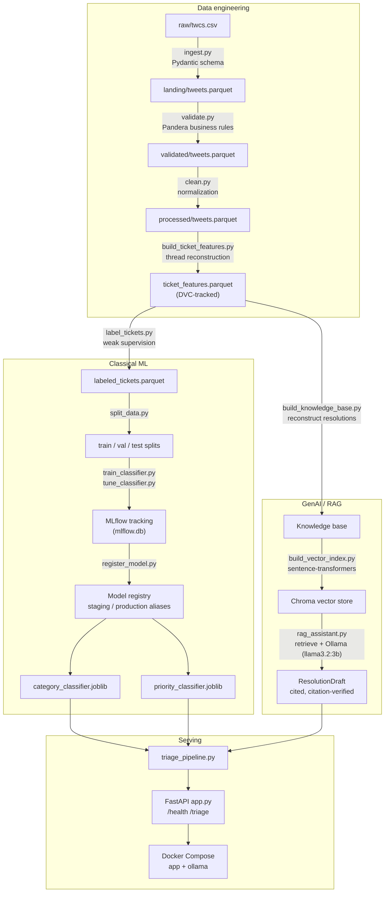

# Architecture

Status: Feature-complete — all five planned phases (data engineering,
classical ML, GenAI/RAG, MLOps/serving, polish) are built and verified.

## System overview

SupportIQ is built as five pipeline stages, each owned by a `src/` module:

| Stage | Module | Responsibility |
|---|---|---|
| Ingestion & validation | `src/data` | Load raw tweets, enforce a schema/data contract, reject or quarantine bad records |
| Feature engineering | `src/features` | Reconstruct reply threads into ticket-level records and derive model-ready features |
| ML triage model | `src/models` | Train/evaluate/register a category + priority classifier |
| Retrieval + generation | `src/ai` | Embed tickets/KB articles, retrieve similar cases, generate a grounded draft response via a local LLM |
| Serving | `src/serving` | FastAPI endpoints exposing classification + resolution-assistant functionality |

## Data flow

```
raw tweets (data/raw, untouched source data)
   → ingestion (schema validation via Pydantic, malformed records quarantined)
   → landing zone (data/landing, schema-conformant Parquet)
   → validation (business-rule checks via Pandera, quality metrics report)
   → validated tier (data/validated, business-rule-passed Parquet)
   → cleaning (text normalization, missing-value policy)
   → processed dataset (data/processed)
   → feature engineering (thread reconstruction → ticket_features.parquet, versioned with DVC)
   → ML training → model registry (MLflow)
   → knowledge base (customer message + resolution pairs, reconstructed from thread data)
   → embeddings (local sentence-transformers) → vector store (local Chroma)
   → RAG pipeline (retrieval + local LLM generation via Ollama) → serving layer
```

The same flow, with the module boundaries and artifacts that actually
produce each arrow:



### Ingestion (`src/data/ingest.py`, `src/data/schema.py`)

The raw dataset is ~2.8M tweets (516 MB as CSV) and is never loaded into
memory in full. `ingest.py` streams it in 50k-row chunks, validates each
row against the `RawTweet` Pydantic model (the data contract — field
types, required fields, parseable dates and ID lists), and writes
conformant rows to `data/landing/tweets.parquet`. Rows that fail
validation are counted and skipped rather than aborting the run, so a
handful of malformed records at row 2 million doesn't take down the whole
ingestion job.

### Validation (`src/data/validate.py`)

Ingestion enforces structural validity — types, parseable values. This
stage enforces business rules on top of that: `tweet_id` uniqueness, valid
value ranges, and a plausible `created_at` window. These are hard checks —
a row that fails one is dropped from the output and counted as rejected.

Not every data-quality issue warrants dropping a row. Referential
completeness (does `in_response_to_tweet_id` point at a tweet that
actually exists in this dataset) and near-duplicate detection
(`author_id` + `text` pairs, common with templated support responses) are
recorded as metrics in a validation report rather than used to reject
records — this dataset is a filtered slice of larger conversations, so
some broken links are expected, not anomalous. The distinction between a
hard check (gates the data) and a soft check (measures the data) is
itself a design decision, not a technical limitation.

Output: the set of rows passing all hard checks is written to
`data/validated/tweets.parquet`; the report (row counts, rejection count,
and the two quality metrics) is written to
`data/validated/validation_report.json`.

### Cleaning (`src/data/clean.py`)

Reads the validated tier and produces the final processed dataset. Two
responsibilities:

- **Text normalization** — Unicode NFKC normalization and whitespace
  collapse, written to a new `text_clean` column. The original `text`
  column is kept as-is; downstream stages choose which they need, and
  provenance isn't lost by overwriting the source field.
- **Missing-value policy, enforced not just assumed** — only
  `response_tweet_id` and `in_response_to_tweet_id` are allowed to be
  null (a tweet with no parent or no replies). Every other column is
  checked and any unexpected null is counted in the cleaning report; on
  this dataset, ingestion and validation already guarantee this, so the
  count is a defensive integrity check between pipeline stages, not
  something expected to fire.

### Feature engineering (`src/features/build_ticket_features.py`)

The processed dataset is tweet-level; a support ticket doesn't exist as a
record until this stage builds one. A ticket is defined as a
customer-initiated reply thread: the root tweet (no parent) has
`inbound = True`. Threads rooted in a brand's own tweet (e.g. a marketing
post that happened to get replies) are not tickets and are excluded
entirely, not just their root row.

Thread membership is resolved by following each tweet's
`in_response_to_tweet_id` link back to its root, using an iterative
find-with-path-compression (the same technique as union-find), so each
tweet's root is computed once and reused rather than re-walked. A tweet
whose parent ID isn't present in the dataset (a broken link, ~0.19% of
responses per the validation report) is treated as its own root rather
than failing.

Each ticket aggregates its full thread into: message counts (customer vs.
brand), the brand account that first responded, time to first response,
and basic text statistics on the opening message.

**Two findings from this stage that affect Phase 2 planning:**

- `resolved` (did the thread get a brand reply) is constant — `True` for
  100% of the 789,547 tickets extracted. This dataset was compiled by its
  creators as customer/brand *exchange pairs*, so every included thread
  already has a reply by construction. It isn't a usable ML feature or
  target on this dataset as defined.
- This dataset has no `category` or `priority` ground-truth labels. Phase
  2's triage classifier will need a labeling strategy — heuristic/keyword
  labels, unsupervised clustering with manual review, or a small
  hand-labeled sample — before it can train a supervised model.

`first_response_seconds` also has a long-tailed outlier (max ~242M
seconds, ~7.7 years) alongside a reasonable median (~1,607 seconds, ~27
minutes) — flagged in `feature_report.json` for Phase 2 to handle (likely
capping or a log transform) rather than silently feeding the raw value
into a model.

Deduplication was deliberately left out. Validation's
`duplicate_author_text_pairs` metric flagged ~4,700 rows, but inspecting
them showed each has a distinct, unique `tweet_id` — they're a support
account sending the same templated reply to different customers, not
duplicate records. Deduplicating on `(author_id, text)` would have
silently deleted real, distinct interactions. The metric was worth
computing to know it existed; acting on it without checking what it
actually represented would have corrupted the dataset.

### Weak-supervision labeling (`src/models/label_tickets.py`, `src/models/explore_categories.py`)

The dataset has no ground-truth `category` or `priority` labels (identified
during feature engineering). Two constraints ruled out the usual fixes:
no hand-labeled sample exists, and there was no budget for LLM-based
labeling. The solution is weak supervision — keyword labeling functions
computed directly from ticket text, at zero cost and no scale limit.

The category keyword lists were not guessed. `explore_categories.py` runs
TF-IDF + LSA (SVD) + KMeans over a sample of ticket text with brand
handles and anonymized customer IDs stripped out first — without that
stripping, clusters mostly rediscover *which company* the tweet is
addressed to (Delta, Apple, Amazon...), which is already captured by
`brand_id` and tells us nothing about issue type. After stripping, several
clusters aligned with real issue-type vocabulary: account/password/access,
order/delivery/package, flight delays, app glitches, service-quality
complaints. Those clusters' top terms directly informed the keyword lists
in `label_tickets.py`.

Raw cluster assignment was **not** used as the label. Roughly half the
sample fell into one large, linguistically generic cluster that KMeans
could not usefully subdivide (silhouette scores stayed low, 0.05–0.09,
across every cluster count tried) — a known limitation of TF-IDF
clustering on short, informal text. Using cluster ID directly would have
produced one dominant meaningless class.

`assign_category` scores each category's keyword matches (word-boundary
regex, apostrophe-normalized so typographic quotes like `'` don't break
contraction keywords) and picks the highest-scoring category, defaulting
to `General Inquiry` when nothing matches. `assign_priority` scores
urgency language, exclamation marks, and ALL-CAPS words into Low/Medium/
High buckets — deliberately computed from ticket text only, never from an
outcome field like `first_response_seconds`, since deriving a label from
an outcome a future model might predict would leak that outcome into its
own target.

### Baseline classifiers (`src/models/split_data.py`, `src/models/train_classifier.py`)

Two separate TF-IDF + logistic regression models — one for `category`,
one for `priority` — trained on the weak-supervision labels, each
compared against a majority-class baseline and tracked in MLflow
(SQLite-backed store at `mlflow.db`; MLflow's plain filesystem backend is
in maintenance mode as of the version used here). A single stratified
70/15/15 train/val/test split (stratified on `category`, the more
imbalanced target) is reused for both models, so a ticket is never in
train for one target and test for the other.

**Read the category metric with its actual meaning, not its face value.**
Test macro F1 is 0.977, uniformly high across all seven classes
(0.94–0.997). That is the signature of a model reconstructing a
deterministic function, not evidence of learned semantic understanding —
expected, because word-level TF-IDF features overlap almost completely
with the exact keyword phrases that define the labels, and there is no
independent ground truth to check real generalization against. This
number answers "did the model recover the labeling rule," not "does the
model understand support ticket categories."

**Priority (test macro F1 0.421) is weaker for a specific, diagnosable
reason, not because it's a harder problem in the abstract.** Part of the
priority label depends on exclamation marks and ALL-CAPS words, but
scikit-learn's default `TfidfVectorizer` lowercases text and strips
punctuation before tokenizing — that signal is structurally invisible to
the model. Feeding those same signals in as explicit features would only
reproduce category's circularity under a different name, so this gap is
documented rather than papered over. Separately,
`class_weight="balanced"` is pushing hard on the rare High-priority
class: precision there is 0.115 (many false positives) against a recall
of 0.447 — a real, tunable cost of balancing against a distribution this
skewed (75% Low / 20% Medium / 5% High), left for the hyperparameter-
tuning stage rather than adjusted ad hoc here.

### Hyperparameter tuning (`src/models/tune_classifier.py`)

Sweeps regularization strength (`C` — 0.1, 1.0, 10.0) and class weighting
(`None`, `balanced`) for both classifiers. The text vectorizer is fit once
per target and reused across the grid, since re-vectorizing is the
expensive step and only the classifier itself changes between trials.
Model selection uses validation macro F1 exclusively; the test set is
scored exactly once per target, after the winning configuration is
already fixed, so tuning can't leak into the reported number.

Category's tuned result (test macro F1 0.987) is only marginally above
the untuned baseline (0.977) — consistent with the earlier finding that
this task is close to its ceiling regardless of configuration, since the
model is reconstructing a deterministic rule rather than learning a
harder decision boundary.

Priority's High-precision problem does not resolve through tuning.
`class_weight="balanced"` wins on validation macro F1 at every
regularization strength tested but one, and the tuned model's
High-priority precision (0.119) is statistically the same as the
untuned baseline (0.115) regardless of `C`. That rules out "the wrong
hyperparameter" as the explanation: macro F1 consistently rewards
balanced weighting despite its precision cost on the rare class, and the
real fix is a feature or evaluation-strategy change (probability
thresholding, or the punctuation/casing features already ruled out in
the baseline stage for circularity reasons) rather than anything in this
grid.

### Model registry (`src/models/register_model.py`)

Registers each tuned classifier as a new version in the MLflow Model
Registry and applies an explicit, code-defined promotion policy via
registry aliases — `staging` and `production` — rather than the
MLflow's older stage-based transitions, which are legacy in the
installed version.

A version reaches `staging` only if it beats its majority-class baseline
by at least 0.05 absolute macro F1; both classifiers cleared this by a
wide margin (category: +0.86, priority: +0.14). It reaches `production`
only if it also matches or beats whatever is currently in production —
or there is no incumbent yet, which was the case for both models' first
versions here. The comparison and promotion decision (`decide_promotion`)
is a pure function, kept separate from the MLflow read/write calls
around it, so the policy itself is fully unit-testable without a live
registry.

### Knowledge base (`src/ai/build_knowledge_base.py`)

The RAG assistant needs actual past resolutions to ground its drafts,
not just ticket metadata. `ticket_features.parquet` carries reply counts
and timing but not reply text, so this stage recomputes thread structure
against the full cleaned tweet dataset and pairs each labeled ticket's
opening message with the first brand reply in its thread by timestamp.
All 789,547 tickets resolved successfully — consistent with the earlier
finding that this dataset guarantees a reply by construction.

### Vector index (`src/ai/build_vector_index.py`)

Embeds a capped, per-category sample of the knowledge base with a local
`sentence-transformers` model (`all-MiniLM-L6-v2`) and stores it in a
persistent local Chroma collection — no external embeddings API.
Embedding the full 789,547-entry knowledge base measured at roughly an
hour on CPU, for limited benefit: the dataset is 77% one category
(General Inquiry), so a proportional embed would produce a retrieval
index dominated by one class. Capping each category at 15,000 entries
(smaller categories keep everything they have) reduced the indexed set
to 96,536 entries and the build to about nine minutes, while guaranteeing
every category is well represented for retrieval.

### RAG resolution assistant (`src/ai/rag_assistant.py`)

Given a new ticket's text, embeds it with the same local model, retrieves
the top-k nearest past tickets from the vector index, and prompts a
local LLM (Llama 3.2 3B via Ollama) to draft a reply grounded in those
examples. The response is a validated structured object (Pydantic model,
generated via Ollama's JSON-schema-constrained output — no free-text
parsing), not free text: a `reply`, the ticket IDs the model claims it
drew on, and a `needs_human_escalation` flag. No network call leaves the
machine.

A real grounding failure showed up on the first live test and was fixed
before treating the pipeline as done: the model copied a tracking URL
verbatim from a retrieved example into its draft for a different
customer. The prompt now explicitly instructs the model not to copy
links, order numbers, case numbers, or usernames from the examples,
since those belong to other customers — write a new reply in the same
style instead. Re-running the same query after the fix produced a clean
draft with no copied identifiers.

Citations the model claims are cross-checked against what was actually
retrieved (`verify_citations`) rather than trusted outright — an LLM
citing a ticket it was never shown is a hallucination, not a real
citation. This safety net is not defensive coding for a hypothetical:
the first evaluation run (below) caught it firing on a real query, where
the model invented two ticket numbers that were never retrieved.

Known limitation, not fixed: the model sometimes echoes structural
labels from the prompt (e.g. `Support reply:`) into its own output — a
formatting literalism typical of a 3B-parameter model, not a grounding
or factual problem. Left as-is rather than over-engineering prompt
formatting for a portfolio-scale assistant.

### Evaluation harness (`src/ai/evaluate_rag.py`)

Runs a fixed set of test queries through the full pipeline and scores
each response on checks that don't require a paid judge: whether any
cited ticket was hallucinated, whether the reply is non-empty, and how
semantically close the reply is to the resolutions it's grounded in
(cosine similarity via the same local embedding model already in the
pipeline). Deliberately does not use the local LLM to judge its own
output — a model scoring its own generations is a known-unreliable
technique, not a real evaluation signal, and there's no independent
judge available without the Claude API this project doesn't have
budget for.

First run against six test queries: 1 of 6 produced a hallucinated
citation (caught and dropped by `verify_citations`, not surfaced to the
user), 4 of 6 were flagged for human escalation, and mean groundedness
similarity was 0.51 — a moderate, not extreme, score. A very high
groundedness score would actually be suspicious here: it would suggest
the model is copying retrieved text rather than paraphrasing it, the
exact failure the citation-copying fix above addressed.

### Triage pipeline (`src/ai/triage_pipeline.py`)

Combines the Phase 2 classifiers and the Phase 3 resolution assistant
into the single classify-then-draft flow the project set out to build:
predict category and priority, then draft a grounded reply. Models are
loaded from the MLflow registry by their `production` alias
(`models:/<name>@production`) rather than from the local `.joblib`
files directly, so the registry is exercised in an actual inference
path, not just at training time.

Running this against a live example surfaced a concrete instance of an
already-documented limitation: a ticket containing "crashing" was
classified as `General Inquiry` instead of `Technical Support`, because
the category keyword pattern `\bcrash\b` requires a word boundary
immediately after "crash" and doesn't match "crashing" — and since the
classifier reconstructs the labeling rule near-perfectly (see the
baseline classifier section above), it inherited the rule's blind spot
along with its accuracy. Not fixed here — doing so would mean
re-running all of Phase 2's training, tuning, and registry steps for a
single keyword-matching edge case — but recorded as concrete evidence
supporting that earlier finding rather than an isolated surprise.

### Serving layer (`src/serving/app.py`, `src/serving/logging_config.py`)

A FastAPI service exposing the triage pipeline over HTTP: `GET /health`
for liveness, `POST /triage` accepting raw ticket text and returning the
same structured response the pipeline produces internally, plus
interactive docs at `/docs` generated automatically from the Pydantic
request/response models.

The triage function is injected via a FastAPI dependency
(`get_triage_fn`) rather than called directly from the route handler, so
the API layer's tests exercise routing, validation, and response shaping
against a fake triage function — no live Ollama, vector index, or MLflow
registry required for that test run. A separate live check against the
actual running server (embedding model, classifiers, and local LLM all
real) confirmed the full path works end to end, including that
structured logging never logs raw ticket text — only its length, which
matters for a service that may see customer-identifying content.

Models are not eagerly loaded at startup. `triage_pipeline` and
`rag_assistant` already lazily load and cache the classifiers, embedding
model, and vector index on first use, so the service starts instantly
and only the first real request pays the model-load cost (measured at
about 14 seconds in a live run) rather than every deployment paying it
upfront before serving anything.

### Docker packaging (`Dockerfile`, `docker-compose.yml`, `requirements-serving.txt`)

The serving stack is two containers, not one: the FastAPI app, and
Ollama for local generation. Model artifacts (`models/`, `mlflow.db`,
`mlruns/`), the vector index (`data/vector_store/`), and the Ollama
model itself are mounted as volumes rather than baked into images —
these are large (the Ollama model alone is 2 GB) and reproducible by
re-running the pipeline scripts, the same reasoning already applied to
every other large artifact in this project.

Three real problems surfaced by actually building and running this,
not by writing the config and assuming it would work:

- **A genuine dependency conflict, hidden by local install order.**
  `mlflow` declares `pandas<3`; the project's `requirements.txt` pins
  `pandas==3.0.5` for the training pipeline. The local dev environment
  had both installed successfully because packages were added
  incrementally across many separate `pip install` calls over several
  sessions, and pip only checks the package being installed against
  what's already present — it doesn't re-validate the whole graph. A
  clean Docker build resolves all dependencies at once and caught the
  conflict immediately. Fixed with a separate `requirements-serving.txt`
  for the image, with `pandas` left unpinned to satisfy `mlflow`'s
  constraint, and training-only tools (`kaggle`, `dvc`, `pandera`) and
  test-only tools (`pytest`, `httpx2`) excluded since the serving image
  never uses them.
- **A false-positive verification.** The first "successful" live test
  against the running container was actually served by a stray local
  `uvicorn` process from an earlier manual test session, still bound to
  `127.0.0.1:8000` — an earlier `kill` had targeted a shell job number
  rather than the actual OS process. Both the stray process and the
  container's port mapping were listening on port 8000 simultaneously,
  and the more specific `127.0.0.1` binding won for local requests. The
  container's own logs never showed the request, which is what exposed
  it — a response that looks correct but that the service you're
  testing never logged receiving is not verification, it's coincidence.
  Killed the stray process and re-ran the test properly.
- **MLflow's local artifact store doesn't survive containerization.**
  With the real container reachable, loading the production classifier
  failed: MLflow's SQLite tracking store keeps only metadata, and its
  local file-based artifact store had recorded an absolute Windows host
  path for the actual model bytes at logging time. Mounting `mlruns/`
  wasn't sufficient, because the database still pointed at a path that
  doesn't exist inside a Linux container. Fixing this properly would
  mean running a real MLflow tracking server with a remote artifact
  store (S3 or similar), which is out of scope for this project's
  local-first, zero-budget constraint. The pragmatic fix: the registry's
  `production` alias is still queried at inference time (a pure
  metadata lookup, confirming a version is registered, no artifact
  download involved), but the actual model object loads from the
  mounted `.joblib` file, which is portable. This is a real, documented
  limitation of local MLflow deployments, not something specific to
  this project's setup.

A fourth, smaller finding: cold-start latency inside a fresh container
(44 seconds) was noticeably higher than the same request run locally
(~14 seconds), because the embedding model had no cached copy to reuse.
Added a named volume for the HuggingFace cache, which reduced repeat
cold starts to about 25 seconds — better, but a meaningful baseline
latency remains, and that remainder is intrinsic to generating with a
3B-parameter model on CPU, not a loading cost to optimize away.

### Continuous integration (`.github/workflows/ci.yml`)

Two jobs run on every push and pull request against `main`:

- **`lint-and-test`** — installs `requirements.txt`, runs `ruff check`
  against `src/` and `tests/`, then the full `pytest` suite. `kaggle`
  and `dvc` are installed too, since they live in the same requirements
  file, but neither is imported by anything the test suite exercises —
  both are used only as CLIs during manual pipeline runs.
- **`docker-build`** — builds the serving image (`docker build .`) to
  catch Dockerfile and `requirements-serving.txt` regressions on every
  push, without starting the container or requiring Ollama in the CI
  environment. This is a build check, not an integration test: it would
  not have caught the artifact-path or stray-process issues found while
  packaging Docker, which needed a running stack and a real request.

`ruff` was added as a dev dependency after checking, not assuming, that
the existing codebase would pass a linter cleanly: an initial run
surfaced 52 findings, all but 3 of them line-length warnings from a
default 88-character limit the project was never written against. The
longest real line in the codebase is 110 characters, so `ruff`'s line
length is configured at 110 in `pyproject.toml` rather than reformatting
working code to fit an arbitrary default. The remaining 3 findings were
real style issues (`== True`/`== False` comparisons in test assertions)
and were fixed directly.

The first CI run caught a real bug the local environment had been
hiding: `requirements.txt` pinned `pandas==3.0.5`, but `mlflow` requires
`pandas<3` — versions that cannot both be satisfied. The local dev venv
had `pandas 2.3.3` actually installed, not the `3.0.5` the file
claimed, because that pin had drifted out of sync with reality across
incremental `pip install` calls over many sessions, the same class of
problem already found once during Docker packaging, this time in the
main dependency file rather than the serving one. A clean install — the
same thing CI does — surfaces this immediately; an incrementally-built
environment does not. Fixed by correcting the pin to `pandas==2.3.3`,
then verifying in a fresh virtual environment (not just re-running
tests in the already-working one) that the install resolves cleanly and
the full suite still passes.

## Design decisions log

Decisions are recorded here as they're made, with the reasoning, so the
"why" behind the architecture is traceable without digging through commit
history.

- **2026-08-13** — Chose a single coherent dataset (customer support
  tickets) to drive every phase, rather than separate toy datasets per
  phase, so the project tells one consistent product story end-to-end.
- **2026-08-13** — Local-first infrastructure (Docker for packaging, no
  managed cloud services during build) with a cloud deploy planned only at
  the end, to keep iteration fast and cost at zero during development.
- **2026-08-13** — Dataset: Kaggle's "Twitter Customer Support" dataset —
  real brand-support exchanges on Twitter. Chosen over more structured,
  pre-labeled ticket datasets because the raw text is noisier and less
  structured, requiring real data-engineering work in Phase 1 (parsing
  conversation threads, handling missing structure, deriving category and
  priority labels rather than reading them off the schema).
- **2026-08-13** — Ingestion streams the raw CSV in chunks rather than
  loading it into a single DataFrame, to keep peak memory bounded
  regardless of dataset size. Landing-zone output uses Parquet (columnar,
  typed, compressed) instead of CSV, since every downstream stage reads
  this file repeatedly and Parquet is both smaller on disk and faster to
  read back than CSV.
- **2026-08-13** — Schema validation (`RawTweet`, a Pydantic model) is
  enforced during ingestion itself rather than deferred entirely to a
  later validation stage. Structural validity (types, parseable dates,
  well-formed ID lists) belongs at the ingestion boundary; business-rule
  validation (allowed value ranges, cross-field consistency) is handled
  separately in the validation stage.
- **2026-08-13** — Business-rule validation uses Pandera instead of Great
  Expectations. Great Expectations' dependency chain requires a numpy
  build with no prebuilt wheel for this Python version, forcing a
  from-source compile; Pandera provides equivalent DataFrame schema and
  check enforcement without that overhead.
- **2026-08-13** — Validation checks are split into hard checks (schema
  violations — the row is dropped) and soft checks (referential
  completeness, near-duplicate detection — a metric is recorded, the row
  is kept). Rejecting on every anomaly would be wrong for a dataset that's
  inherently a partial slice of larger conversations; the goal is
  visibility into data quality, not zero tolerance.
- **2026-08-13** — Split what was originally a single `data/processed`
  output into `data/validated` (business-rule-passed, pre-cleaning) and
  `data/processed` (final, cleaned). Collapsing them into one tier made
  "processed" ambiguous about whether cleaning had actually happened yet.
- **2026-08-13** — No deduplication in the cleaning stage. The duplicate
  `(author_id, text)` pairs surfaced by validation are legitimate distinct
  interactions with unique `tweet_id`s (templated support replies to
  different customers), not duplicate records — confirmed by inspecting a
  sample before writing any drop logic against the metric.
- **2026-08-13** — A ticket is defined as a thread rooted in a
  customer-initiated tweet. Brand-initiated threads (marketing tweets that
  received replies) are excluded entirely rather than kept with a null
  ticket-opener, since they don't represent a support interaction.
- **2026-08-13** — DVC's remote is a local filesystem path outside the
  repository (`C:\Users\Ander\.dvc-storage\supportiq`), not inside the
  OneDrive-synced project folder. The project directory is already
  cloud-synced by OneDrive; pointing DVC's cache at the same tree would
  double-sync large data files. This remote will move to cloud storage
  (S3/GCS) when the project reaches its cloud-deploy phase.
- **2026-08-13** — Only `ticket_features.parquet` (83 MB, the final
  feature-engineered artifact) is tracked with DVC, not the larger
  intermediate tiers (`tweets.parquet` at 458 MB, the landing-zone file).
  Those are fully reproducible by re-running the pipeline scripts against
  the same raw source, so versioning only the artifact that's expensive
  to regenerate and directly consumed downstream avoids duplicating
  hundreds of megabytes in the DVC cache for no reproducibility benefit.
- **2026-08-13** — No budget for LLM-based labeling, so category/priority
  labels are generated by weak supervision (keyword labeling functions)
  instead of an LLM API. Category keywords are grounded in an exploratory
  TF-IDF/KMeans clustering pass (with brand names and IDs stripped) rather
  than picked arbitrarily; raw cluster assignment was rejected as the
  label itself because roughly half the data falls into one
  indistinguishable cluster.
- **2026-08-13** — Priority scoring reads ticket text only, never
  `first_response_seconds` or any other post-open outcome field, even
  though response time is an intuitive urgency proxy. A label built from
  an outcome the classifier might later be asked to predict (or that
  correlates with what it predicts) leaks the answer into its own target.
- **2026-08-13** — One stratified split (on `category`), reused for both
  the category and priority classifiers, rather than splitting
  independently per target. Keeps a given ticket in the same partition
  for both models — simpler to reason about than two splits that
  disagree on which tickets are held out.
- **2026-08-13** — Switched MLflow's tracking backend from the default
  filesystem store to SQLite (`sqlite:///mlflow.db`) after the filesystem
  backend raised a maintenance-mode error on the installed MLflow
  version. This is the currently recommended backend, not a workaround.
- **2026-08-13** — Did not add exclamation-mark/ALL-CAPS features to the
  priority classifier to close its accuracy gap with category. Those
  features are literally the inputs to the priority labeling function;
  feeding them to the model would reproduce category's rule-reconstruction
  circularity rather than fix anything. The gap is documented as an
  understood, structural property of training on weak-supervision labels
  with a feature space narrower than the label's own construction.
- **2026-08-13** — Hyperparameter tuning selects on validation macro F1
  only, with the test set scored once after selection is final. Choosing
  hyperparameters against the test set would make the final reported
  number optimistic in a way that doesn't hold up on genuinely new data.
- **2026-08-13** — The text vectorizer is fit once per target and reused
  across the tuning grid instead of being refit inside a full pipeline
  per trial. Vectorizing 550k+ documents is the expensive step; only the
  classifier changes between grid points, so refitting it every trial
  wastes runtime without changing the result.
- **2026-08-13** — Model promotion uses MLflow registry aliases
  (`staging`/`production`), not the legacy stage-transition API. Aliases
  are the current registry mechanism in the installed MLflow version.
- **2026-08-13** — Promotion requires a 0.05 absolute macro F1 lift over
  the majority-class baseline before a version can reach staging, and
  requires matching or beating the current production version before it
  can replace it. A fixed, code-defined threshold applied uniformly is
  the point — it stops "the model works" from being a subjective call
  made per run.
- **2026-08-13** — Phase 3's GenAI layer runs entirely on local, free
  tools (`sentence-transformers` for embeddings, Chroma for the vector
  store, Llama 3.2 3B via Ollama for generation) instead of the Claude
  API originally planned. Same constraint as the Phase 2 labeling
  pivot: no billing credits on the account, and purchasing them is a
  real-money decision outside this project's scope. The vector store
  choice (Chroma) was already local in the original plan; only the
  embedding and generation steps changed.
- **2026-08-13** — Vector index caps each category at 15,000 entries
  rather than embedding the full 789,547-ticket knowledge base. The full
  embed measured at roughly an hour on CPU for a dataset that is 77% one
  category — a proportional index would be dominated by General Inquiry
  and under-serve retrieval for every other category. Capping keeps
  every category represented and cuts the build to under ten minutes.
- **2026-08-13** — The RAG prompt explicitly forbids copying links,
  order numbers, case numbers, or usernames from retrieved examples,
  added after the model copied a real tracking URL from one customer's
  resolution into a draft for a different customer on the first live
  test. Caught by actually running the pipeline against a real query
  before considering it done, not by inspecting the code.
- **2026-08-13** — The RAG assistant returns a Pydantic-validated
  structured object via Ollama's JSON-schema-constrained output, not
  parsed free text. A serving layer consuming unstructured text would
  need to re-parse it heuristically; a validated schema is a contract.
- **2026-08-13** — Citations the model claims are cross-checked against
  what was actually retrieved and dropped if not (`verify_citations`),
  rather than passed through to the caller unverified. An LLM stating a
  ticket number is not evidence that ticket was actually used.
- **2026-08-13** — The evaluation harness does not use the local LLM to
  judge its own output. Self-judging is a known-unreliable technique;
  the harness instead uses checks that don't require a language model's
  opinion at all — hallucinated-citation detection and embedding-based
  groundedness — plus a note that this is not equivalent to a real
  quality judgment, since no independent judge is available without a
  paid API this project doesn't have budget for.
- **2026-08-13** — Switched model logging from MLflow's default `skops`
  serialization to `pickle` after `skops`'s type-introspection triggered
  a `transformers` lazy-import chain requiring `torchvision` (not
  installed) — but only when `sentence-transformers` had already been
  imported earlier in the same process, which the triage pipeline does.
  `skops` exists to avoid pickle's arbitrary-code-execution risk on
  untrusted models; that risk doesn't apply to models this project
  trained itself, so pickle was the pragmatic fix rather than adding an
  unrelated heavy dependency (`torchvision`) just to satisfy an
  incidental introspection call. Re-registered both models as new
  versions after the fix.
- **2026-08-13** — The triage pipeline loads production models via their
  MLflow registry alias (`models:/<name>@production`) instead of reading
  the local `.joblib` files directly, even though both are available.
  Reading straight from disk would mean the registry's promotion
  decision is never actually consulted at inference time — it would
  exist only as a training-time formality.
- **2026-08-13** — The `/triage` endpoint takes its triage function via
  a FastAPI dependency instead of importing and calling `triage()`
  directly. The API layer's own tests can then swap in a fake function
  and verify routing, validation, and response shaping without needing
  Ollama, the vector index, or the MLflow registry available in the test
  environment — those are exercised separately by the modules' own
  tests and by a live run against the real server.
- **2026-08-13** — No eager model loading at FastAPI startup. Both
  `triage_pipeline` and `rag_assistant` already lazily load and cache
  their models on first use; adding startup warm-up would duplicate that
  logic and would have forced the app's test suite to load real models
  just to construct the `TestClient`, since FastAPI's lifespan runs on
  app startup regardless of dependency overrides on individual routes.
- **2026-08-13** — Structured request logs never include raw ticket
  text — only its length. A support ticket can carry customer-
  identifying or sensitive content, and a log line is a much less
  controlled surface than the API response itself.
- **2026-08-13** — Switched the test suite's HTTP transport from `httpx`
  to `httpx2` after Starlette's `TestClient` logged a deprecation
  warning recommending it. Verified `httpx2` is a real, actively
  published package (not a speculative or unmaintained one) before
  adopting it, rather than either ignoring the warning or switching on
  faith.
- **2026-08-13** — The serving image installs a separate
  `requirements-serving.txt` rather than the project's main
  `requirements.txt`. The two have a real, not hypothetical, dependency
  conflict (`mlflow` requires `pandas<3`; the training pipeline pins
  `pandas==3.0.5`) that a clean dependency resolution enforces and the
  incrementally-built local dev environment had been silently avoiding.
- **2026-08-13** — Docker Compose uses named volumes for the Ollama
  model and the HuggingFace embedding-model cache, not bind mounts to
  host paths. A bind mount to this machine's actual Ollama directory
  would have avoided a 2 GB re-download during setup, but would have
  hardcoded a Windows-user-specific absolute path into a public
  repository — not reproducible for anyone else running this project,
  and not something to trade portability for personal convenience.
- **2026-08-13** — At inference time, the triage pipeline still queries
  the MLflow registry's `production` alias, but loads the actual model
  object from the mounted `.joblib` file rather than through MLflow's
  artifact-store resolution. Local MLflow's file-based artifact store
  records absolute host paths at logging time, which don't resolve
  inside a container; a full fix would require a real tracking server
  with remote artifact storage, out of scope here. The registry lookup
  is kept because it's still real verification — a missing or
  unpromoted model fails loudly — even though the artifact bytes come
  from a different, portable source.
- **2026-08-13** — Ruff's line-length limit is set to 110 rather than
  its 88-character default. The alternative was reformatting a working,
  already-tested codebase purely to satisfy a linter default that
  predates the linter being added to the project; the actual longest
  line already in the codebase is 110 characters, so the limit reflects
  existing practice rather than loosening a real standard.
- **2026-08-13** — `requirements.txt`'s `pandas` pin was corrected from
  `3.0.5` to `2.3.3` after the first CI run failed a clean dependency
  resolution (`mlflow` requires `pandas<3`). The local dev environment
  had been running `2.3.3` all along; the file's pin was simply stale
  and nothing had exercised a clean install of it before CI did. Verified
  in a fresh virtual environment, not just by trusting the fix.
- **2026-08-13** — CI's Docker job builds the image but doesn't run it.
  A real integration test would need Ollama available in the CI
  environment and a multi-minute model pull on every run, for a
  workflow this project already verifies manually before each release
  point. A build-only check still catches the class of failure most
  likely to regress silently: a Dockerfile or `requirements-serving.txt`
  change that breaks the image build itself.
